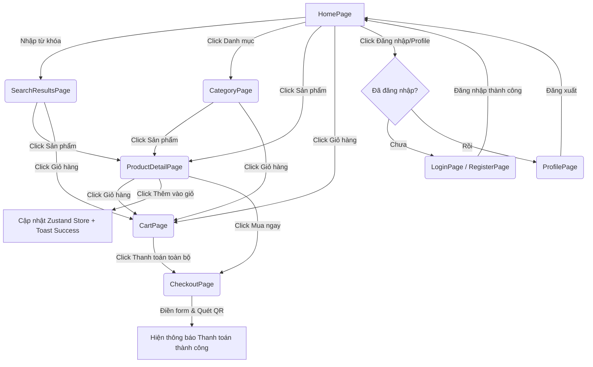

# Project Requirements: E-Commerce Electronics Frontend

## 1. Project Overview
Đây là dự án Frontend cho một trang web thương mại điện tử chuyên bán đồ điện tử (Điện thoại, Laptop, Tai nghe, Đồng hồ, Tablet).
Dự án được xây dựng bằng React (Vite) + Tailwind CSS.
Mục tiêu hiện tại là xây dựng giao diện hoàn chỉnh, sử dụng Mock Data nhưng có kiến trúc gọi API chuẩn (Axios + React Query) để sau này dễ dàng ghép nối với Backend thật (REST API).

## 2. Directory Structure
Kiến trúc thư mục theo chuẩn Feature-based, tách biệt UI và Logic:

```text
src/
├── api/            # Chứa cấu hình Axios và định nghĩa API calls (mock)
├── assets/         # Hình ảnh, logo, icon tĩnh
├── components/     # UI Component dùng chung
│   ├── layout/     # MainLayout, CheckoutLayout
│   └── ui/         # Button, Input, ProductCard, Toast
├── hooks/          # Custom hooks (ví dụ: useCart, useProducts)
├── pages/          # Các trang chính (HomePage, CartPage...)
├── store/          # Zustand store (quản lý state global như giỏ hàng)
├── types/          # JSDoc definitions / TypeScript interfaces
└── utils/          # Các hàm helper (format giá tiền VND, v.v.)
```

## 3. Required Components
- **Layouts:**
  - `MainLayout`: Gồm `Header` (Logo trái, Search giữa, Cart icon phải), Nội dung trang (Outlet), và `Footer`.
  - `CheckoutLayout`: Chỉ có `Header` tối giản (Logo góc phải, không search, không cart), và Nội dung trang (Outlet).
- **UI Components:**
  - `Header`: Thanh điều hướng.
  - `CategoryNav`: Dải các nút chọn danh mục (Điện thoại, Laptop, Tai nghe, Đồng hồ, Tablet).
  - `ProductCard`: Card hiển thị Ảnh, Tên, Giá sản phẩm.
  - `Banner`: Section hiển thị thông điệp "Đồ điện tử chất lượng cao, giá siêu tốt".
  - `CartItem`: Component hiển thị 1 dòng sản phẩm trong giỏ hàng.
- **Pages:**
  - `HomePage`: Trang chủ (Hiển thị Header, CategoryNav, Banner, danh sách Sản phẩm nổi bật).
  - `SearchResultsPage`: Trang kết quả tìm kiếm (Giữ Header, ẩn CategoryNav & Banner, hiện danh sách kết quả).
  - `CategoryPage`: Trang sản phẩm theo danh mục (Giữ Header, CategoryNav, ẩn Banner, hiện danh sách theo loại).
  - `ProductDetailPage`: Trang chi tiết (Giữ Header. Hiển thị Ảnh + Gallery thumbnails, Tên, Giá theo variant được chọn, chọn variant theo Phiên bản & Màu sắc, và hiển thị Mô tả + Thông số kỹ thuật. Có nút Mua ngay và Thêm vào giỏ).
  - `CartPage`: Trang giỏ hàng (Giữ Header. Hiện danh sách item, nút xoá item, tổng số lượng, tổng tiền, nút Thanh toán toàn bộ).
  - `CheckoutPage`: Form thanh toán (Dùng CheckoutLayout. Form nhập Họ tên, SĐT, Địa chỉ text thường, mã QR thanh toán tĩnh, nút Xác nhận).
  - `LoginPage` & `RegisterPage`: Trang đăng nhập/đăng ký.
  - `ProfilePage`: Trang quản lý thông tin cá nhân (hiển thị thông tin, cập nhật avatar, họ tên, số điện thoại).

## 5. Products API Alignment

Frontend phải tuân theo API Products của backend trong [products_api.md](products_api.md), đặc biệt:

- **List API (`GET /api/products/`)**
  - Filters: `keyword`, `category`, `brand`, `min_price`, `max_price`, `page`.
  - Response theo DRF pagination: `count`, `next`, `previous`, `results`.
  - Field list item: `id`, `name`, `base_price` (string), `main_image` (string | null).
- **Detail API (`GET /api/products/{id}/`)**
  - Field detail: `images`, `variants`, `options`, `base_price` (string).
  - UI render theo yêu cầu mới:
    - Chọn variant theo `options.version` và `options.color`, mapping sang `variants[]`.
    - Hiển thị Giá theo variant được chọn (`variants[*].price`), fallback `base_price` nếu không chọn được variant.
    - Ảnh chính ưu tiên `selectedVariant.variant_image.image` (nếu có), fallback theo `images`/`main_image`.
    - Hiển thị Mô tả (`description`) và Thông số kỹ thuật (`specs`) bên dưới.
  - Nếu `main_image` hoặc `images` bị `null`, cần có fallback ảnh.
- **Giá**
  - `base_price` và `variants[*].price` là string, cần parse để format VND.
- **Phân trang**
  - Chỉ dùng `page`, không dùng `page_size`.

## 6. Implementation Guidance (For AI)

Muc nay dung de AI co the doc va cap nhat code theo Products API backend.

- Cap nhat luong list san pham de dung DRF pagination (`results[]`) thay cho `data[]`.
- Map dung `base_price` (string) -> parse so -> format VND.
- Su dung `main_image`/`images` voi fallback khi `null`.
- ProductDetailPage phai:
  - Chon variant theo Phiên bản (version) & Màu (color) tu `options`/`variants`.
  - Mac dinh select 1 variant khi vao trang (neu co variants).
  - Cho phep user chon **doc lap** giua version va color (khong auto doi option con lai).
  - Khi doi variant: doi gia va doi anh chinh theo `variant_image` (neu co).
  - Hien gallery thumbnails 1 hang ben duoi anh chinh; click thumbnail doi anh chinh.
  - Hien mo ta (`description`) va bang thong so ky thuat (`specs`) ben duoi; `specs` render dang table key/value.
  - Neu `description`/`specs` null/empty thi an section (khong tu bịa noi dung).
  - Neu khong tim thay variant khop cap (version, color) da chon: coi nhu chua chon duoc variant va fallback theo `base_price` + anh fallback.
  - KHONG hien thi cac truong noi bo cua variant len UI (vi du: `sku`, `stock`, `variant id`).
- Them ho tro `page` param cho cac trang list.

## 7. Cart API Alignment (Backend)

Frontend Cart cần được chuẩn hoá để có thể chuyển từ client-side (Zustand) sang server-side theo backend spec trong `cart_order_api.md`.

### 7.1. Endpoints
- `GET /api/cart/` (không auto-create; nếu chưa có cart trả `200` với `{ "message": "..." }`)
- `GET /api/cart/count/` (badge navbar; nếu chưa có cart trả `{ "count": 0 }`)
- `POST /api/cart/items/` (add item theo `product_variant_id`, cộng dồn nếu đã tồn tại)
- `PATCH /api/cart/items/{item_id}/` (update quantity; không cho `quantity=0`)
- `DELETE /api/cart/items/{item_id}/` (xóa item)

### 7.2. Auth + Error format
- Tất cả endpoints Cart **yêu cầu đăng nhập**.
- Lỗi DRF được bọc theo format:

```json
{
  "error": {
    "status_code": 400,
    "message": "Bad Request",
    "details": { "field": ["msg"] }
  }
}
```

### 7.3. UI/Business rules
- Badge trên Header hiển thị **tổng quantity** (không phải số dòng): ưu tiên dùng `GET /api/cart/count/` hoặc `cart.cart_count` từ `GET /api/cart/`.
- Cart totals ưu tiên theo backend: `total_amount = sum(unit_price * quantity)`.
- Các field tiền (`total_amount`, `unit_price`, `line_total`) là decimal string ⇒ cần parse trước khi format VND.
- Khi add/update vượt tồn kho: backend có thể trả `400` với `error.details.quantity`.

### 7.4. Dữ liệu item cần hiển thị
UI Cart/Checkout cần hiển thị đúng variant đã chọn:
- Version (`product_variant.version`)
- Color (`product_variant.color`)
- Ảnh hiển thị: ưu tiên `product_variant.product.main_image` (backend có thể trả absolute URL, hoặc `null`)

## 4. User Flow

